# KAI-X Component Relationships

This document provides detailed views of component relationships within each module and their internal architectures.

## Execution Engine Internal Architecture

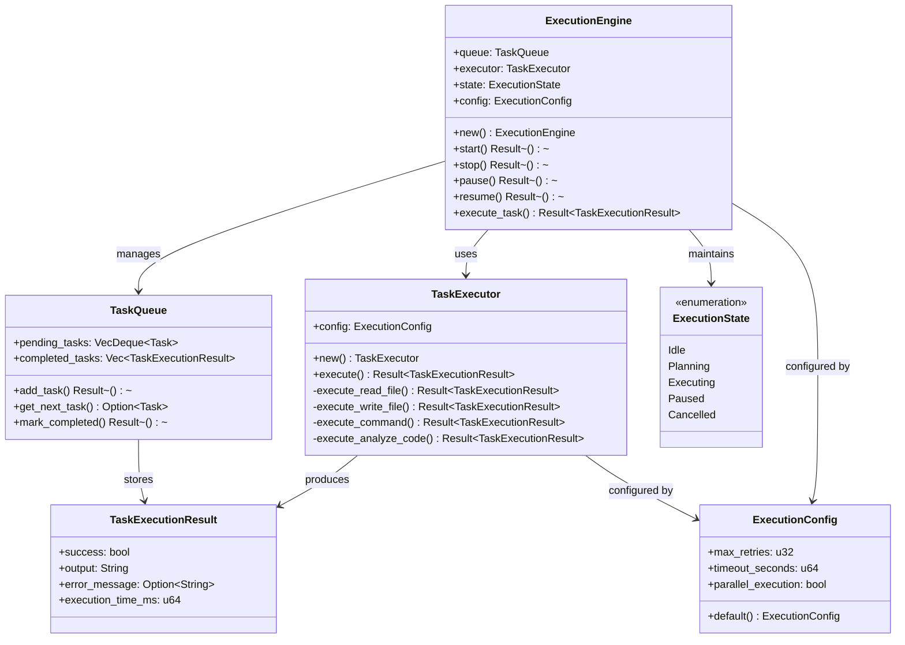

## LLM Provider Architecture

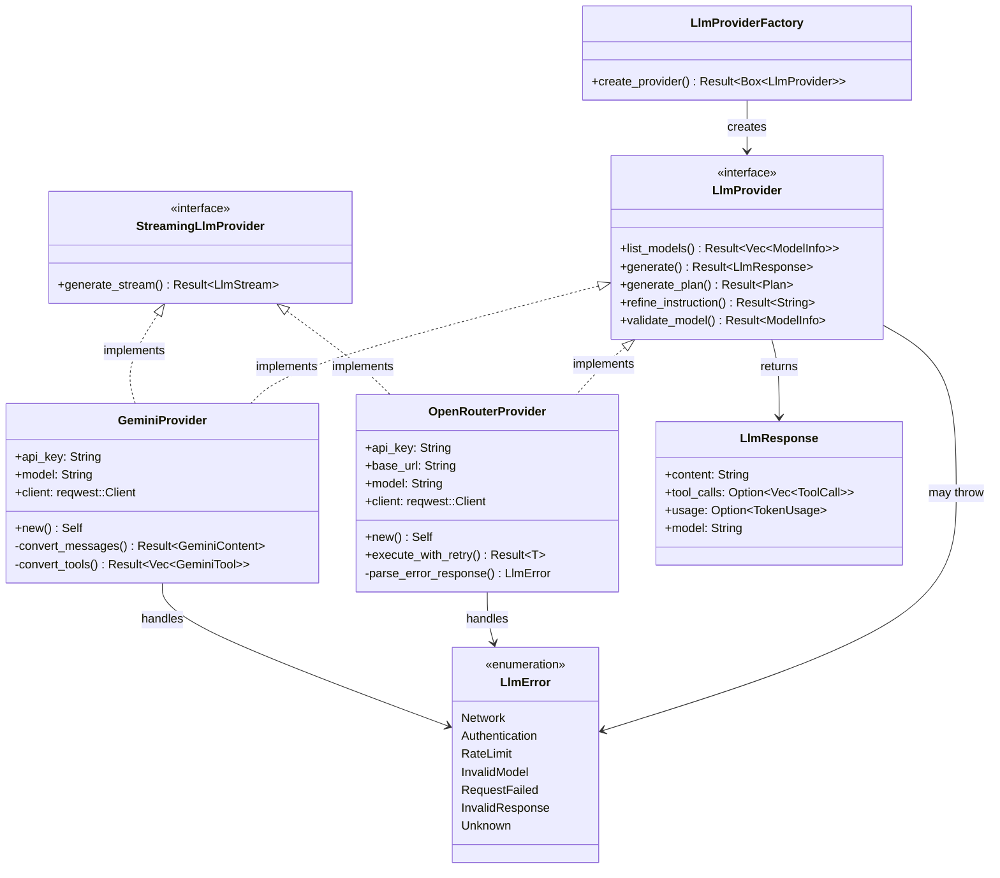

## Enhanced Context Management Architecture

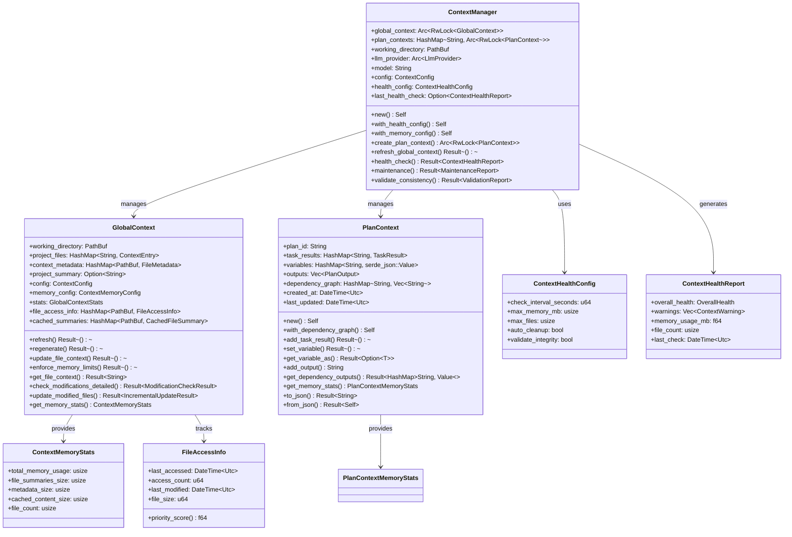

## UI Component Architecture

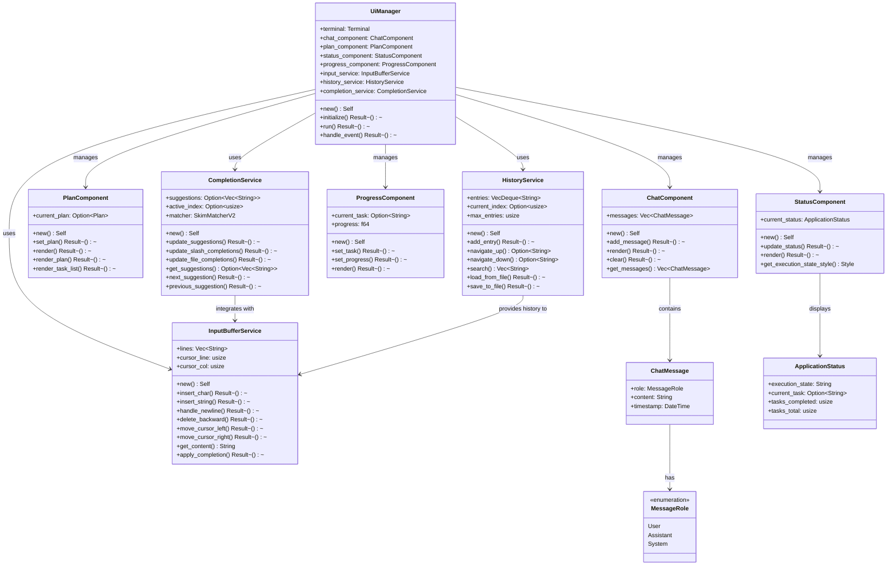

## Agentic Planning System Architecture

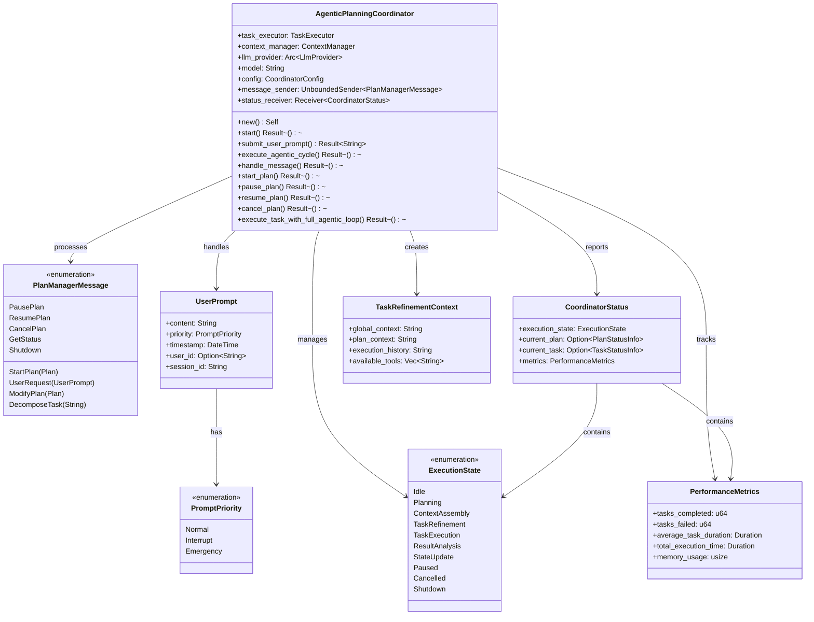

## Configuration System Architecture

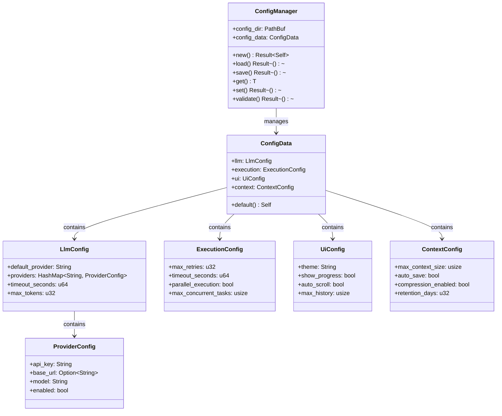

## File System Operations Component

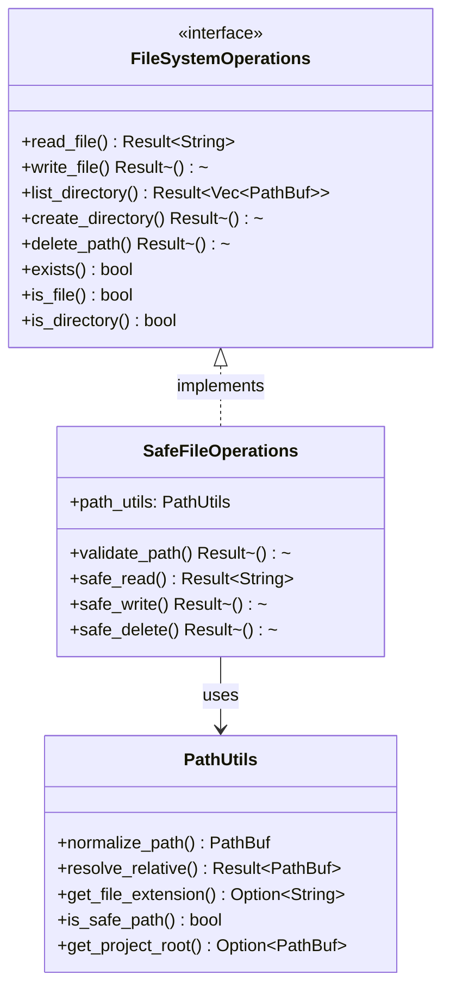

## Error Handling Component

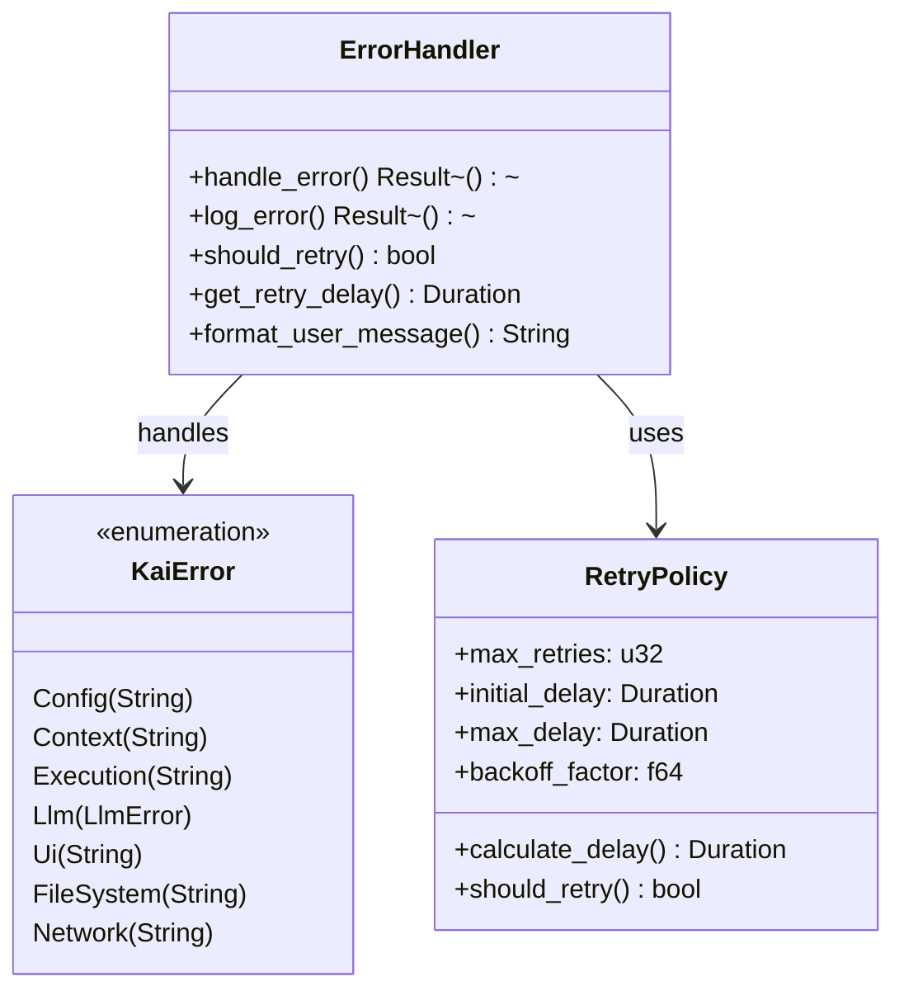

## Agentic Loop Architecture

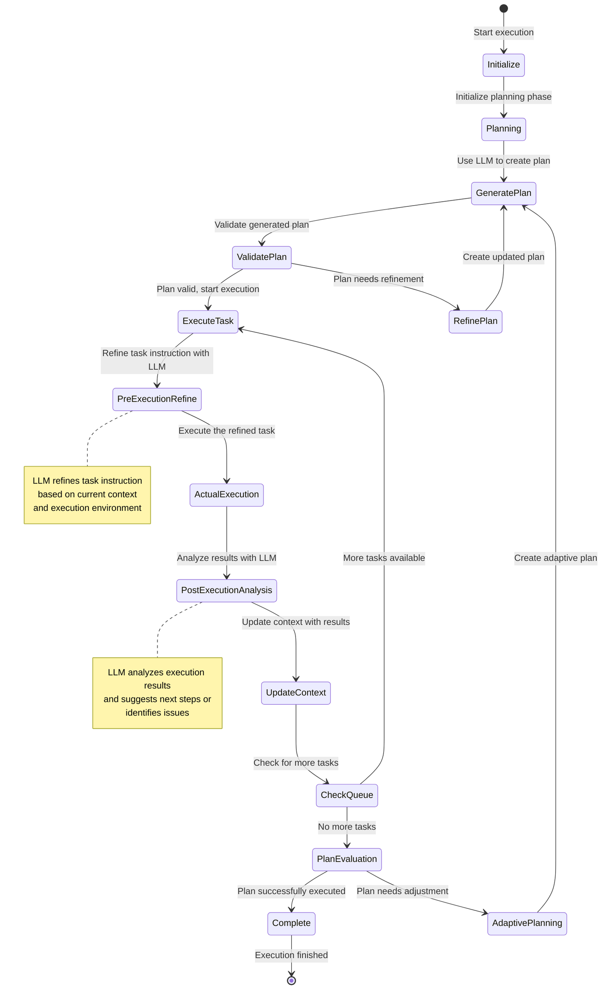

## Streaming Architecture

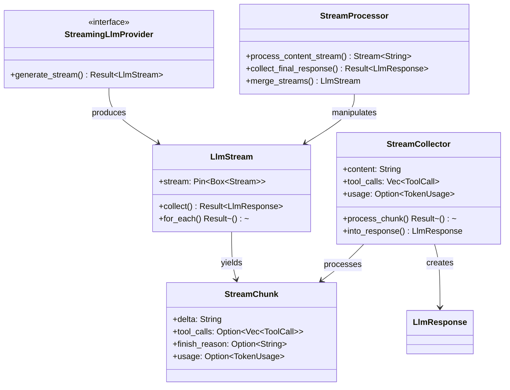

## Task Types and Execution Patterns

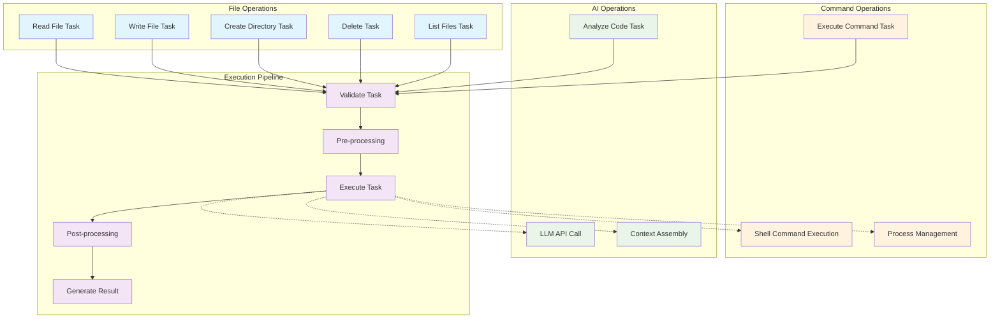

## Component Communication Protocols

### Async Message Passing
- **Execution Engine ↔ LLM Provider**: Async requests with Result types
- **UI Manager ↔ Execution Engine**: Event-driven communication with callbacks
- **Context Manager ↔ All Modules**: Shared state through Arc<RwLock<>>
- **Task Executor ↔ File System**: Direct async I/O operations

### Error Propagation
- **Bottom-up**: Low-level errors bubble up through Result types
- **Cross-cutting**: Logging system captures errors at all levels
- **User-facing**: UI layer translates technical errors to user-friendly messages

### State Synchronization
- **Context Updates**: Atomic updates through RwLock mechanism
- **Configuration Changes**: Immediate propagation to affected modules
- **Execution State**: Shared state with atomic operations

### Performance Considerations
- **Async Operations**: Non-blocking I/O throughout the system
- **Streaming**: Chunked processing for large LLM responses
- **Caching**: Context and configuration caching for performance
- **Resource Management**: Proper cleanup and resource deallocation