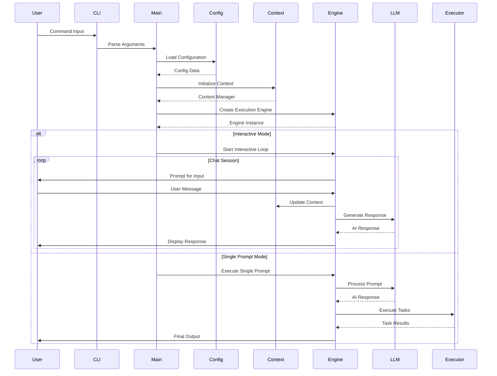
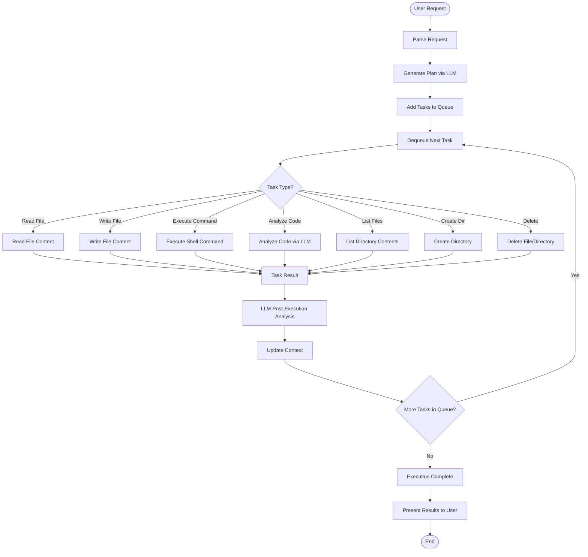

# KAI-X Data Flow Diagrams

This document illustrates how data flows through the KAI-X system during various operations.

## Main Application Data Flow

## Task Execution Flow

## LLM Provider Data Flow

## Context Management Flow

## Configuration Flow

## Error Handling Flow

## Data Types and Structures

### Key Data Structures Flow
- **Messages**: User input → CLI parsing → Message struct → LLM processing
- **Tasks**: Plan generation → Task queue → Individual task execution → Results
- **Context**: Global context + Plan context → Context updates → Persistent storage
- **Configurations**: File system → Config manager → Runtime access → Modifications
- **Responses**: LLM API → Response parsing → Stream processing → User output