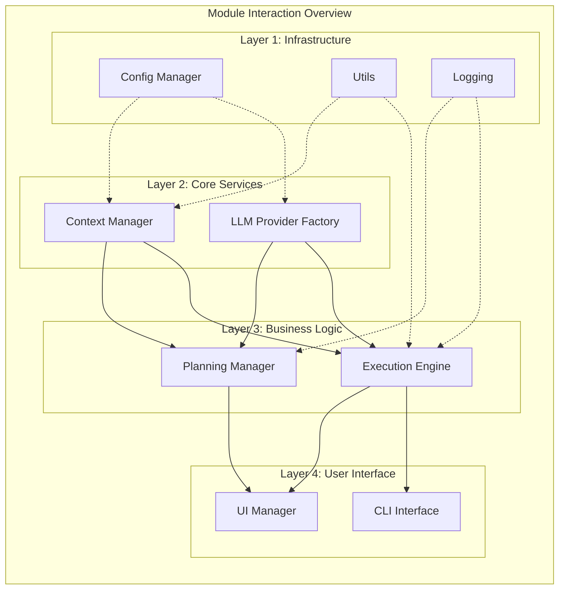
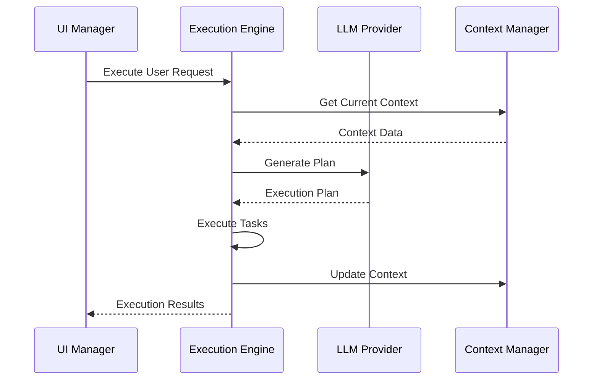
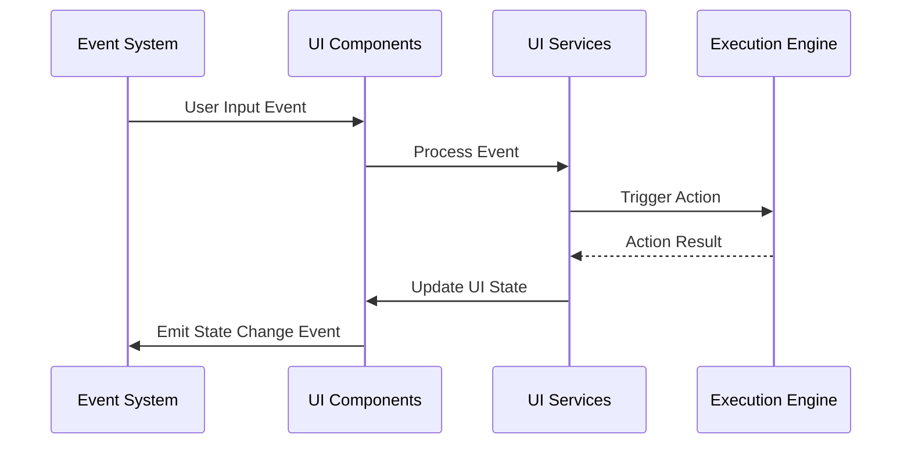
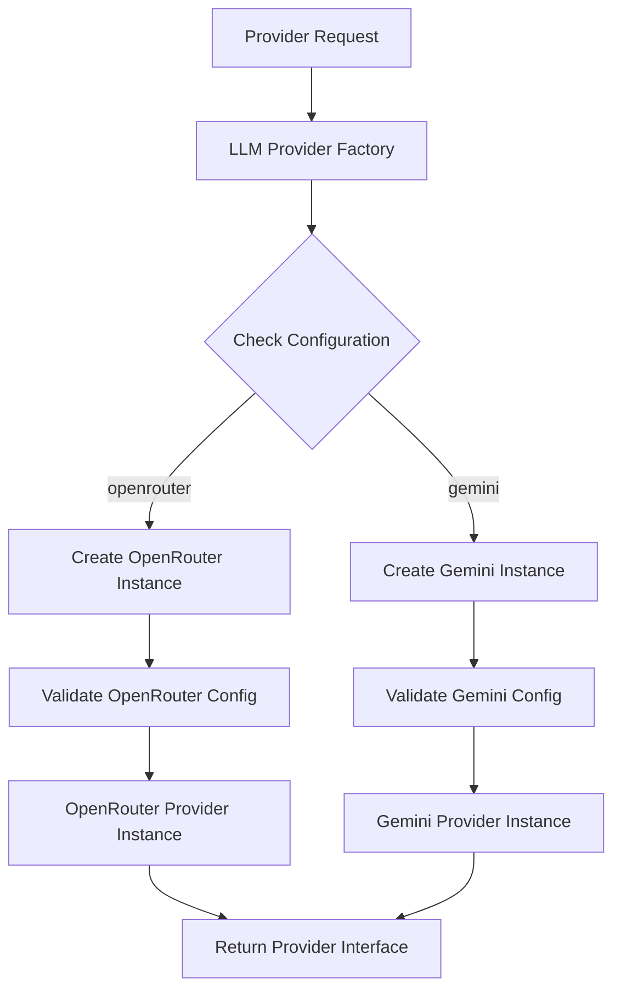

# KAI-X Module Interactions

This document illustrates the detailed interactions and dependencies between different modules in the KAI-X system.

## Module Dependency Graph

```mermaid
graph TD
    subgraph "External Dependencies"
        Clap[clap - CLI parsing]
        Tokio[tokio - Async runtime]
        Reqwest[reqwest - HTTP client]
        Serde[serde - Serialization]
        Tracing[tracing - Logging]
    end
    
    subgraph "Core Modules"
        Main[main.rs]
        Lib[lib.rs]
        Config[config/mod.rs]
        Context[context/mod.rs]
        Utils[utils/mod.rs]
    end
    
    subgraph "Context Module"
        ContextManager[context/manager.rs]
        GlobalContext[context/global.rs]
        PlanContext[context/plan.rs]
    end
    
    subgraph "LLM Module"
        LLMCore[llm/mod.rs]
        OpenRouter[llm/openrouter.rs]
        Gemini[llm/gemini.rs]
        Streaming[llm/streaming.rs]
        Prompts[llm/prompts.rs]
        LLMUtils[llm/utils.rs]
    end
    
    subgraph "Execution Module"
        ExecutionCore[execution/mod.rs]
        Executor[execution/executor.rs]
        QueueSystem[execution/queue.rs]
    end
    
    subgraph "Planning Module"
        PlanningCore[planning/mod.rs]
        PlanManager[planning/manager.rs]
    end
    
    subgraph "UI Module"
        UICore[ui/mod.rs]
        Components[ui/components.rs]
        Events[ui/events.rs]
        Services[ui/services.rs]
    end
    
    %% External dependencies
    Main --> Clap
    Main --> Tokio
    Main --> Tracing
    LLMCore --> Reqwest
    LLMCore --> Serde
    Context --> Serde
    Config --> Serde
    
    %% Core module relationships
    Main --> Lib
    Main --> Config
    Main --> Context
    Main --> ExecutionCore
    Main --> LLMCore
    Main --> UICore
    
    %% Context module internal relationships
    Context --> ContextManager
    Context --> GlobalContext
    Context --> PlanContext
    ContextManager --> GlobalContext
    ContextManager --> PlanContext
    
    %% LLM module internal relationships
    LLMCore --> OpenRouter
    LLMCore --> Gemini
    LLMCore --> Streaming
    LLMCore --> Prompts
    LLMCore --> LLMUtils
    OpenRouter --> Streaming
    Gemini --> Streaming
    
    %% Execution module internal relationships
    ExecutionCore --> Executor
    ExecutionCore --> QueueSystem
    Executor --> Utils
    
    %% Planning module relationships
    PlanningCore --> PlanManager
    PlanManager --> LLMCore
    PlanManager --> PlanContext
    
    %% UI module internal relationships
    UICore --> Components
    UICore --> Events
    UICore --> Services
    Components --> Events
    Services --> Events
    
    %% Cross-module dependencies
    ExecutionCore --> LLMCore
    ExecutionCore --> Context
    ExecutionCore --> PlanningCore
    PlanningCore --> Context
    UICore --> Context
    UICore --> ExecutionCore
    
    classDef coreModule fill:#f3e5f5
    classDef contextModule fill:#e1f5fe
    classDef llmModule fill:#e8f5e8
    classDef execModule fill:#fff3e0
    classDef planModule fill:#fce4ec
    classDef uiModule fill:#f1f8e9
    classDef external fill:#ffebee
    
    class Main,Lib,Config,Utils coreModule
    class Context,ContextManager,GlobalContext,PlanContext contextModule
    class LLMCore,OpenRouter,Gemini,Streaming,Prompts,LLMUtils llmModule
    class ExecutionCore,Executor,QueueSystem execModule
    class PlanningCore,PlanManager planModule
    class UICore,Components,Events,Services uiModule
    class Clap,Tokio,Reqwest,Serde,Tracing external
```

## Detailed Module Interaction Matrix

## Inter-Module Communication Patterns

### 1. Request-Response Pattern

### 2. Event-Driven Pattern

### 3. Factory Pattern

## Module Responsibilities

### Configuration Module (config/)
- **Primary Function**: Application configuration management
- **Interactions**: 
  - Provides config to all other modules
  - Uses utils for path operations
  - Persists to file system

### Context Module (context/)
- **Primary Function**: State and context management
- **Interactions**:
  - Used by execution engine for task context
  - Updated by planning system
  - Provides data to LLM providers
  - Manages global and plan-specific state

### LLM Module (llm/)
- **Primary Function**: AI provider abstraction and implementation
- **Interactions**:
  - Used by execution engine for AI capabilities
  - Used by planning system for plan generation
  - Streams responses to UI layer
  - Handles multiple provider implementations

### Execution Module (execution/)
- **Primary Function**: Task orchestration and execution
- **Interactions**:
  - Coordinates with LLM providers for AI assistance
  - Updates context with execution results
  - Uses planning system for task planning
  - Executes file system operations via utils

### Planning Module (planning/)
- **Primary Function**: Intelligent task planning
- **Interactions**:
  - Uses LLM providers for plan generation
  - Updates plan context
  - Provides plans to execution engine
  - Receives feedback for plan refinement

### UI Module (ui/)
- **Primary Function**: User interface and interaction
- **Interactions**:
  - Displays execution results from engine
  - Handles user input events
  - Communicates with all core systems
  - Manages terminal interface components

### Utils Module (utils/)
- **Primary Function**: Common utilities and helpers
- **Interactions**:
  - Used by all modules for common operations
  - Provides path manipulation for file operations
  - Contains shared utility functions

## Data Flow Between Modules

1. **User Input Flow**: UI → Main → Execution Engine → LLM Provider → Context
2. **Plan Generation Flow**: Planning Manager → LLM Provider → Context → Execution Engine
3. **Task Execution Flow**: Execution Engine → Task Executor → Utils → File System
4. **Context Update Flow**: Any Module → Context Manager → Persistent Storage
5. **Configuration Flow**: Config Manager → All Modules (read-only access)
6. **Error Propagation Flow**: Any Module → Error Handler → UI → User

## Coupling Analysis

- **Loose Coupling**: LLM providers are abstracted through traits
- **Medium Coupling**: Context manager is used by multiple modules
- **Tight Coupling**: Execution engine coordinates multiple subsystems
- **Configuration Coupling**: All modules depend on configuration for initialization