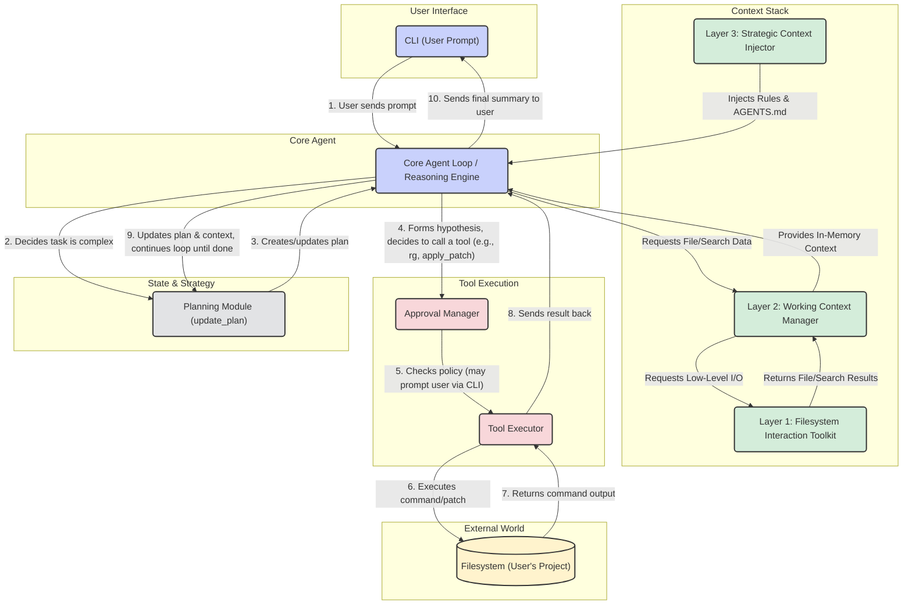

# Codex Architecture Diagram

This diagram illustrates the major modules of the Codex architecture and the flow of a typical user request.

It shows how a user's prompt initiates a cycle of reasoning and action, mediated by a structured "Context Stack" and a secure "Tool Execution" layer, with the "Planning Module" guiding the entire process.

### Explanation of the Flow:

1.  **Prompt:** The user initiates a task through the **CLI**.
2.  **Reasoning & Planning:** The **Core Agent Loop** receives the prompt. It consults the **Strategic Context** (its core rules + `AGENTS.md`) and, for any non-trivial task, calls the **Planning Module** to create a step-by-step plan.
3.  **Context Building:** To execute the plan, the agent needs information. It requests data via the **Working Context Manager (WCM)**, which in turn uses the **Filesystem Interaction Toolkit (FIT)** to run commands like `rg` (search) or `cat` (read) on the actual **Filesystem**.
4.  **Tool Execution & Approval:** When the agent decides to take an action (like reading a file or applying a patch), the request is sent to the **Approval Manager**. This module acts as a security gate, checking the current policy and prompting the user for confirmation if necessary.
5.  **Action:** If approved, the **Tool Executor** runs the command or applies the patch to the files on disk.
6.  **Iterate:** The result of the action is fed back into the **Agent Loop**, which updates its **Working Context** and the **Plan**. The agent then continues to the next step, repeating the cycle until the task is complete.
7.  **Response:** Once the plan is fully executed, the agent generates a final summary and presents it to the user via the **CLI**.
