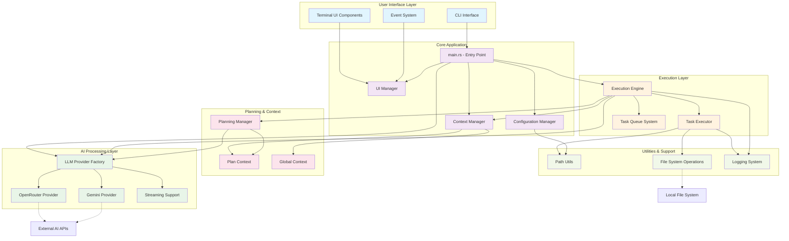

# KAI-X System Architecture

This document contains the architecture diagrams for the KAI-X AI coding assistant.

## High-Level System Architecture

## Component Descriptions

### User Interface Layer
- **CLI Interface**: Command-line argument parsing and main entry point
- **Terminal UI Components**: Interactive terminal user interface elements
- **Event System**: Handles user input events and UI interactions

### Core Application
- **main.rs**: Application entry point, initializes all systems
- **Configuration Manager**: Handles application configuration and settings
- **Context Manager**: Manages application state and context
- **UI Manager**: Coordinates user interface components

### AI Processing Layer
- **LLM Provider Factory**: Creates and manages AI provider instances
- **OpenRouter Provider**: Integration with OpenRouter API
- **Gemini Provider**: Integration with Google Gemini API
- **Streaming Support**: Handles streaming responses from AI providers

### Execution Layer
- **Execution Engine**: Main orchestrator for task execution with agentic loop
- **Task Executor**: Executes individual tasks (file operations, commands, etc.)
- **Task Queue System**: Manages dual-queue system for task scheduling

### Planning & Context
- **Planning Manager**: Handles intelligent task planning
- **Plan Context**: Maintains context specific to execution plans
- **Global Context**: Manages global application state and context

### Utilities & Support
- **Path Utils**: File path manipulation utilities
- **File System Operations**: Low-level file system interactions
- **Logging System**: Application logging and tracing

## Key Architectural Patterns

1. **Modular Design**: Clear separation of concerns across different layers
2. **Async/Await**: Extensive use of asynchronous programming for performance
3. **Trait-based Abstraction**: AI providers implement common traits for flexibility
4. **Factory Pattern**: LLM providers are created through a factory for extensibility
5. **Event-Driven UI**: User interface responds to events for better interactivity
6. **Context Management**: Centralized state management across the application