# KAI-X System Architecture

This document contains the architecture diagrams for the KAI-X AI coding assistant.

## High-Level System Architecture

```mermaid
graph TB
    subgraph "User Interface Layer"
        CLI[CLI Interface]
        ChatUI[Chat Component]
        PlanUI[Plan Visualization]
        StatusUI[Status Component]
        ProgressUI[Progress Component]
        InputService[Input Buffer Service]
        HistoryService[History Service]
        CompletionService[Completion Service]
    end
    
    subgraph "Core Application"
        Main[main.rs - Entry Point]
        Config[Configuration Manager]
        Context[Context Manager]
        UI[UI Manager]
    end
    
    subgraph "AI Processing Layer"
        LLM[LLM Provider Factory]
        OpenRouter[OpenRouter Provider]
        Gemini[Gemini Provider]
        Streaming[Streaming Support]
    end
    
    subgraph "Execution Layer"
        Engine[Execution Engine]
        Executor[Task Executor]
        Queue[Task Queue System]
    end
    
    subgraph "Planning & Context"
        AgenticCoordinator[Agentic Planning Coordinator]
        PlanContext[Enhanced Plan Context]
        GlobalContext[Advanced Global Context]
        HealthMonitor[Context Health Monitor]
        MemoryManager[Context Memory Manager]
    end
    
    subgraph "Utilities & Support"
        Utils[Path Utils]
        FileSystem[File System Operations]
        Logging[Logging System]
    end
    
    %% User Interface connections
    CLI --> Main
    ChatUI --> UI
    PlanUI --> UI
    StatusUI --> UI
    ProgressUI --> UI
    InputService --> UI
    HistoryService --> UI
    CompletionService --> UI
    
    %% Core Application connections
    Main --> Config
    Main --> Context
    Main --> Engine
    Main --> UI
    Main --> LLM
    
    %% AI Processing connections
    LLM --> OpenRouter
    LLM --> Gemini
    LLM --> Streaming
    Engine --> LLM
    AgenticCoordinator --> LLM
    
    %% Execution Layer connections
    Engine --> Executor
    Engine --> Queue
    Engine --> AgenticCoordinator
    Executor --> FileSystem
    Executor --> Utils
    
    %% Context connections
    Context --> GlobalContext
    Context --> PlanContext
    Context --> HealthMonitor
    Context --> MemoryManager
    AgenticCoordinator --> PlanContext
    AgenticCoordinator --> Context
    Engine --> Context
    
    %% Support connections
    Config --> Utils
    Executor --> Logging
    Engine --> Logging
    
    %% External integrations
    OpenRouter -.-> Internet[External AI APIs]
    Gemini -.-> Internet
    FileSystem -.-> Disk[Local File System]
    
    classDef userLayer fill:#e1f5fe
    classDef coreLayer fill:#f3e5f5
    classDef aiLayer fill:#e8f5e8
    classDef execLayer fill:#fff3e0
    classDef planLayer fill:#fce4ec
    classDef utilLayer fill:#f1f8e9
    
    class CLI,TUI,Events userLayer
    class Main,Config,Context,UI coreLayer
    class LLM,OpenRouter,Gemini,Streaming aiLayer
    class Engine,Executor,Queue execLayer
    class Planning,PlanContext,GlobalContext planLayer
    class Utils,FileSystem,Logging utilLayer
```

## Component Descriptions

### User Interface Layer
- **CLI Interface**: Command-line argument parsing and main entry point
- **Chat Component**: Interactive chat interface for AI conversations with message history
- **Plan Visualization**: Real-time display of execution plans with task status and progress
- **Status Component**: Application status monitoring with execution state visualization
- **Progress Component**: Task progress tracking with visual progress indicators
- **Input Buffer Service**: Advanced text editing with multi-line support, cursor management, and completion integration
- **History Service**: Command history with fuzzy search and persistent storage
- **Completion Service**: Intelligent auto-completion for commands, files, and context-aware suggestions

### Core Application
- **main.rs**: Application entry point, initializes all systems and coordinates startup
- **Configuration Manager**: Handles application configuration, settings validation, and runtime updates
- **Context Manager**: Advanced context orchestration with health monitoring and memory management
- **UI Manager**: Coordinates sophisticated ratatui-based user interface components

### AI Processing Layer
- **LLM Provider Factory**: Creates and manages AI provider instances with trait-based abstraction
- **OpenRouter Provider**: Integration with OpenRouter API featuring retry logic and error handling
- **Gemini Provider**: Integration with Google Gemini API with message conversion and tool support
- **Streaming Support**: Handles real-time streaming responses from AI providers with chunk processing

### Execution Layer
- **Execution Engine**: Main orchestrator coordinating with agentic planning system
- **Task Executor**: Comprehensive task execution supporting file operations, commands, code analysis, and content generation
- **Task Queue System**: Advanced queue management with priority handling and task dependencies

### Planning & Context
- **Agentic Planning Coordinator**: Sophisticated autonomous planning system with message-based communication, priority handling, and adaptive execution
- **Enhanced Plan Context**: Advanced plan tracking with dependency management, output tracking, variable storage, and memory statistics
- **Advanced Global Context**: Comprehensive context management with memory limits, modification tracking, file summaries, and incremental updates
- **Context Health Monitor**: System health monitoring with validation, maintenance operations, and performance metrics
- **Context Memory Manager**: Memory usage optimization with caching strategies and cleanup operations

### Utilities & Support
- **Path Utils**: File path manipulation utilities
- **File System Operations**: Low-level file system interactions
- **Logging System**: Application logging and tracing

## Key Architectural Patterns

1. **Modular Design**: Clear separation of concerns across different layers
2. **Async/Await**: Extensive use of asynchronous programming for performance
3. **Trait-based Abstraction**: AI providers implement common traits for flexibility
4. **Factory Pattern**: LLM providers are created through a factory for extensibility
5. **Event-Driven UI**: User interface responds to events for better interactivity
6. **Context Management**: Centralized state management across the application